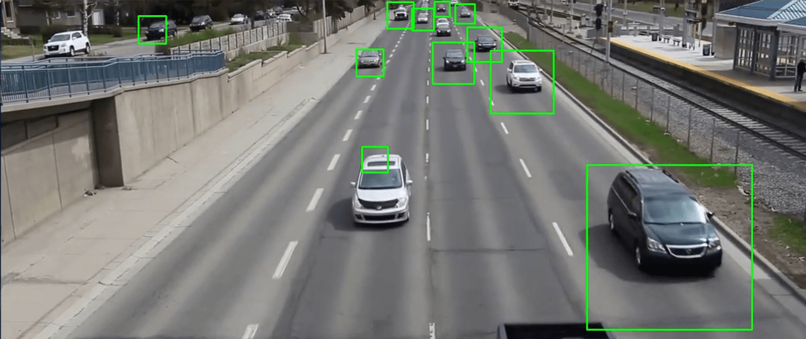

= Vespucci Drone
ifndef::imagesdir[:imagesdir: ../images]
:revealjs_parallaxBackgroundImage: ../images/sky.png
:revealjs_parallaxBackgroundSize: cover

== Projektarbeit
* Kapsch hat ein Team für eine Projektarbeit gebraucht
** Android App für Drohne entwickeln
** Neue Geschäftsfelder für Drohnen entdecken

=== Drohnen
[.float-group]
'''
image::mavicmini.png[float="left",width=400]
image::air2.png[width=400]
'''

=== Kamera App
[.float-group]
'''
image::gimbalsdk.png[float="left", width=400]
image::cam.png[width=400]
'''

=== Map mit Wegpunkte
image::map.png[width=300]

== Feuererkennung
image::firefire.png[]

=== Problem mit KI
image::muffin.png[width=600]

[%notitle]
=== d
image::firediagram.png[]

== Andere UseCases

=== Menschenmenge erkennen
image::corona.png[]

=== Stau

== Wie gehts weiter
* TAGs auf der App ausgeben
* Neues Team finden für die Weiterarbeit